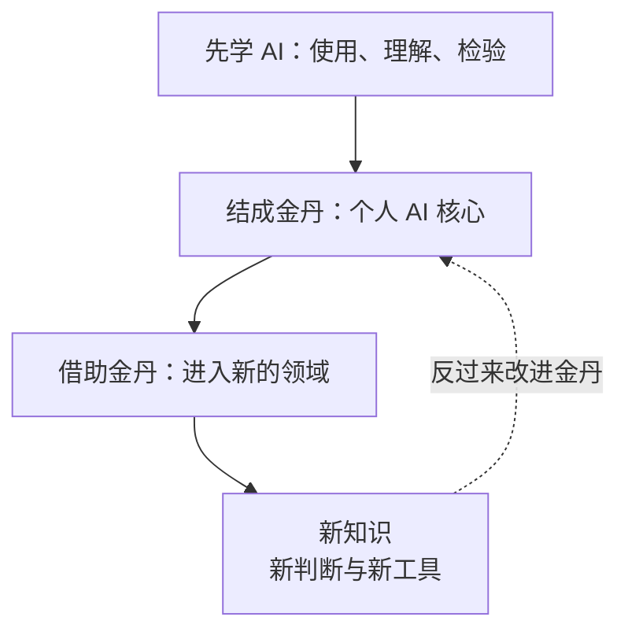

想象一个修真世界：天下典籍每天都在增加，新功法、新法器、新阵法不断出现，一个人的寿命和精力却仍然有限。如果必须先读完所有典籍，才有资格开始修炼，那他可能一生都走不出藏书阁。

这很像我们今天面对的处境。知识不断增长，领域之间也越来越相互关联。想做一个自己的智能设备，可能同时遇到编程、电子、机械和 AI 的问题。每走一步，都可能发现另一门需要学习的知识。

过去，我们常把学习想成一条长路：先学一门，再学下一门，积累足够多的知识后，才开始尝试更大的事情。知识爆炸的时代，个人很难靠有限的时间，把自己需要的领域逐个学完。更麻烦的是，等我们学到后面，前面的工具和方法可能已经变了。

所以，我想调整学习的顺序。对于希望跨领域学习、创造东西的人，**我认为最值得优先做的，是学习 AI，形成自己的 AI 能力，再借它扩展知识边界。** 这是我眼中的成长路径上的“最优解”：先增加后续学习的能力，让之后每一门知识都能借助这份能力来学习。

如果用修真的话来说，就是先炼出自己的金丹，再以金丹为根基，继续变强。

这里的“学习 AI”，包含几个实际能力：能把一个模糊目标说清楚，能请 AI 把问题拆开，能理解它给出的解释，也能查证和检验它的结果。进一步，还可以学习大语言模型怎样工作，怎样把模型接到自己的资料和工具上，以及怎样用开源模型做实验和改造。

这个阶段也需要基础知识。遇到编程、数学或数据处理的门槛，就围绕眼前任务补上它们。你会逐渐学会判断：哪些东西必须自己深入理解，哪些可以先借助工具处理，下一步最值得学什么。

我把这种逐渐成形的个人 AI 能力叫作“金丹”。它有几个相互配合的部分：可使用的模型、自己积累的资料、能完成任务的工具，以及检查结果的方法。它们共同组成一个可以反复使用、持续改进的智能核心。

比如，研究一个陌生问题时，它能根据你的目标整理资料、解释术语、提出学习路线；你完成实验后，又能把结果带回来，修正原来的理解。借助开源模型、准备自己的数据、进行微调和评估，则能让这颗金丹更贴合你的需要。金丹的成色，最终要看它能否稳定帮助你学习和完成任务。

有了这个核心，再去拓展其他领域，就有了一套可重复使用的方法。进入电子领域，可以先让 AI 解释电路图里的陌生元件，再读资料、做小实验；遇到机械结构的问题，可以请它梳理需要理解的知识，再用实际设计检验。领域换了，提问、查证、实验和反馈的能力仍然能用。

新的知识还会反过来改善这颗金丹。你更懂电子，就更能发现电路建议中的问题；你更懂编程，就能给 AI 配上更好的工具；你更懂某个专业，就能提出更准确的任务和检验标准。改进后的 AI，又帮助你进入下一个领域。

**这张图就是我想表达的修炼循环。** 金丹帮助你学习，学到的东西又提升金丹。能力在一轮轮实践中积累，知识边界也随之向外扩展。

我说“AI 可以无限放大一个人的能力”，想表达的正是这种不断向外生长的可能。一个人能做的事情，不再只由已经记住多少知识决定，还取决于他能否组织工具、获取新知识，并把理解转化成行动。

沿着这条主线，修炼境界也有了更具体的含义：

1. **炼气：先学会使用 AI。** 从真实问题开始，练习提出目标、拆解任务、追问解释和查证结果。先感知这股力量，也学会辨认它什么时候可靠。
2. **筑基：理解 AI 的根基。** 学习大语言模型、数据和必要的编程知识，逐渐理解模型怎样工作、有哪些边界，以及怎样与工具配合。
3. **金丹：形成自己的 AI 核心。** 把模型、个人资料、工具和检验方法组织起来，通过开源实践、定制和评估，让它持续服务自己的学习与创造。
4. **元婴：借助金丹扩展知识边界。** 进入新的学科，用 AI 帮助理解，再通过阅读、实验和专业实践检验。金丹开始在越来越多的问题中发挥作用。
5. **化神：把跨领域知识组成系统。** 将已经连接起来的知识用于真实目标，构建能够协同工作的软件、工具和流程，逐步承担更复杂的任务。
6. **合体：让系统进入物理世界。** 将 AI 与传感器、机器人和设备结合，使它能够感知环境、参与行动，把屏幕中的推演延伸到现实中的创造。
7. **渡劫：经受现实检验。** 面对错误、故障和意外，检查系统能否处理异常、及时停下和恢复。现实中的结果，决定这套能力究竟有多扎实。
8. **大乘：形成持续学习与创造的能力。** 能从发现问题出发，学习所需知识，改进自己的 AI，再构建解决问题的系统。每一次创造，也为下一次成长积累根基。

这条路上，人的判断始终重要。AI 给出一段流畅解释时，要检查它有没有依据；给出一个方案时，要检验它是否真的能用。目标越清楚，反馈越具体，修炼才越容易积累成真实能力。

学习也要在自己的理解里留下东西。今天借助 AI 做成一件事，之后要能说清关键原理、知道哪里容易出错，并在条件变化时调整办法。这些沉淀，会成为下一轮修炼的根基。

科技修真的时代，对我来说意味着一种新的学习顺序：先集中力量掌握 AI，炼出自己的金丹，再借这颗金丹认识更大的世界。天下典籍还会继续增长，我们也可以不断提高学习和创造的能力，走出藏书阁，去炼器、布阵和造物。
