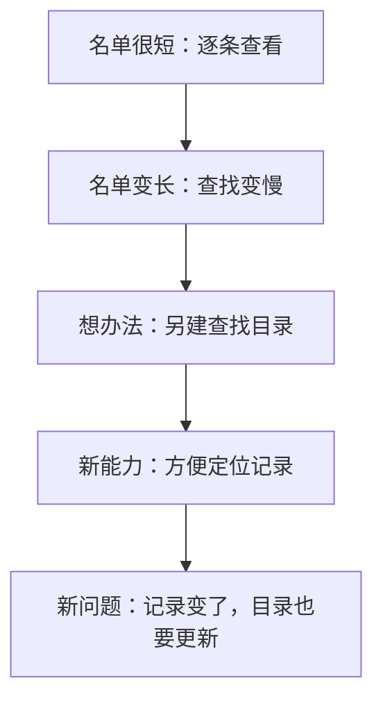
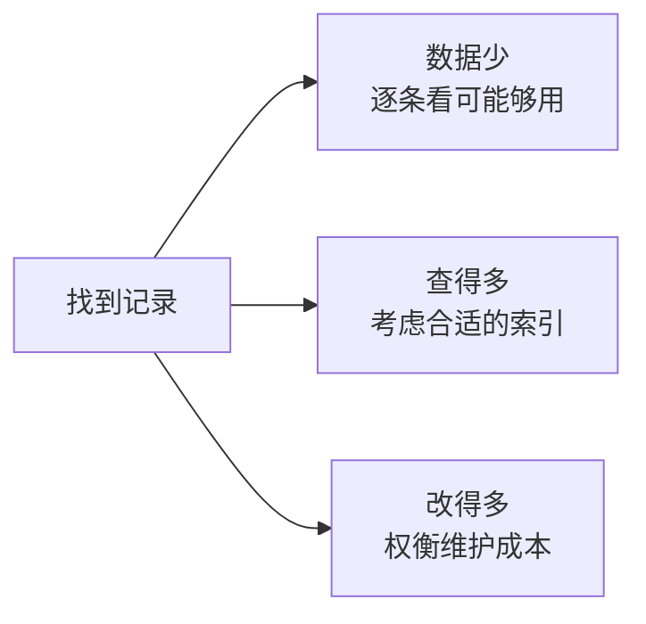
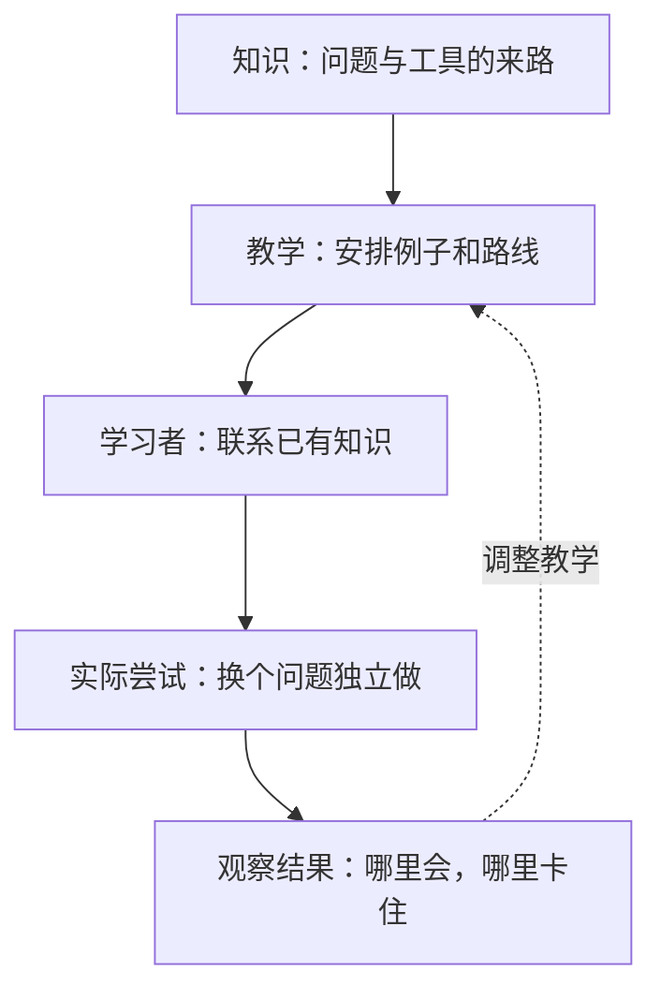

你可能有过这种经历：课上听懂了，例题也会做。可老师换了个问法，你就不知道从哪里下手。

为什么知道一个概念，却认不出什么时候该用它？我们先从一个很小的问题开始：在一份名单里找一个人。

只有几十个名字时，从头看一遍就行。名单长到几百万条，再这样查就很慢了。你会开始想：能不能提前做点准备，以后每次查找都省点时间？

一种办法是另做一份按姓名排序的目录，在每个姓名旁记下原始记录的位置。查找时先查目录，再去取记录。带着这个问题接触数据库“索引”，你就有了理解它的起点：多维护一份方便查找的结构，换取某些查找操作的便利。

**图 1：一个概念怎样从问题中出现。** 顺着箭头看，新办法解决了旧问题，也带来了新的成本。这是一条帮助理解索引的教学路线。

Evo-Learn 就是这样组织学习的。它带我们先看问题，再试已有办法，发现办法不够用的地方，最后引出新概念。概念有了来路，我们也更容易知道它该用在哪里。

如果只记住“索引能加快查询”，遇到新任务时，你可能只想到加索引。经历刚才的过程，你还会考虑名单有多长、要怎样查找，以及维护目录要花多少力气。你开始能判断，哪种情况下值得使用这个工具。

**我认为，Evo-Learn 最有价值的地方，是让我们把概念和使用条件一起学进去。** 忘了术语，还能从问题重新想起来；情况变了，也能检查原来的办法是否合适。

这和系统论有什么关系？可以先把“系统”理解成一组相互配合的东西。刚才的例子里，原始记录、查找目录、查询方式和更新操作共同决定了查找效果。只盯着目录本身，很容易漏掉它和其他部分的关系。Evo-Learn 让我们沿着问题观察这些关系，理解改变一个部分后，整体会怎样变化。

但这里也藏着它的第一个边界。刚才讲的是一条容易理解的路线，真实情况还有其他选择。

名单很短时，逐条查找可能已经够用；查得多、改得少时，维护目录可能划算；记录频繁变化时，更新目录的成本就更值得考虑。不能因为新工具出现得晚，就认为它在所有情况下都更好。

**图 2：条件不同，选择就可能不同。** 图中的分支提醒我们：工具的价值要放回具体场景判断。这些条件也可能同时存在。

复杂系统的演化可以从这里理解：很多因素一起变化，不同选择又会改变后面的条件。新工具可能让人想做更多事情，新的需求再推动工具改变。发展过程因此会有分支、回头路和相互影响。

刚才的名单故事，是为理解索引而安排的教学路线。要说明索引真实的发明过程，还需要查历史材料。教学时，我们通常选一条路线讲清楚。这个选择能帮助理解，也会省略一些东西。如果读者把这条路线当成唯一可能的道路，就容易学会一个顺畅的故事，却漏掉真实问题中的其他条件。

所以，学完一个概念后，可以多问一句：**换一个条件，这个办法还好用吗？** 对索引来说，我们可以增加更新操作，改变查询方式，或者缩小数据量。这些变化会帮助我们看见概念的边界。

还有一个更容易被忽略的问题：知识可以这样讲，人就一定能这样学会吗？

理解一种技术怎样形成、把它安排成一堂课、让一个人真正掌握它，是三个相互关联的过程。它们之间的连接需要检查。

拿刚才的例子来说，如果你已经做过数据查找，很容易理解“维护目录有成本”。如果你连排序和记录位置都不熟悉，独立推导索引就会困难得多。同一段讲解，对一个人是启发，对另一个人可能是负担。

可以用“桌面”和“书架”来想象学习。桌面是你此刻能同时顾及的信息，空间有限；书架是已经积累的知识。书架上的东西越熟悉，越容易拿来处理眼前问题。这只是帮助理解的比喻。认知研究中，先前知识会影响新信息怎样被理解、记住和提取；[相关综述](https://pubmed.ncbi.nlm.nih.gov/32954007/)讨论了这些关系。

如果桌面上全是陌生词，学习者可能忙着弄懂每个词，顾不上看它们之间的联系。此时，给一个具体示范、解释几个基础概念，会更有帮助。有了基础，再逐渐减少提示，让他自己推演。关于教学指导和认知负荷的[经典综述](https://doi.org/10.1207/s15326985ep4102_1)也强调了先备知识的重要性。

Evo-Learn 本身就包含提示和验证环节。它能否有效，取决于这些环节是否真的根据学习者的困难调整。仅仅把知识排成一条漂亮的演化路线，还不够。

我们也应该谨慎使用“人脑模型”这个说法。知识结构、注意力和记忆等模型，能帮助我们解释某些学习现象、设计学习活动。它们提供的启发，并不能直接证明 Evo-Learn 的顺序就是大脑天然的学习顺序。

接下来，还需要检查能力有没有留下来。解释就在眼前时，你可能能跟着推理；隔几天撤掉材料，或者换一道题，表现就可能变化。听懂、记住、独立判断，需要分别检验。

**图 3：从知识到能力，还需要反馈。** 上面的箭头表示教学怎样帮助学习；返回的虚线表示，我们要根据实际表现调整教学。这是学习过程的简化图，并非大脑结构图。

比如，学完索引之后，给自己一个“查询少、更新多”的场景，解释为什么选择会变化。几天后再给一个陌生场景，不看笔记做判断。卡住时，再检查缺的是基础知识、概念关系，还是实际练习。

过一段时间再从记忆里找回知识，就是提取练习。[研究综述](https://pubmed.ncbi.nlm.nih.gov/20951630/)表明，它有助于长期保持，反馈也能帮助修正错误。Evo-Learn 强调回忆、推导、应用和重建，正可以通过这些活动检查学习。不过，某个环节有效，并不能直接证明整套方法已经得到完整验证。

现在，我们可以把三张图连起来看：第一张帮助我们理解概念的来路；第二张提醒我们改变条件，检查工具的边界；第三张把学习者的表现带回来，用来调整下一步。

我因此更愿意把 Evo-Learn 用于那些需要理解“为什么”、比较设计选择、重新推导概念的主题。对记术语、练操作、形成熟练技能，还要安排相应的记忆和实践活动。学习目标不同，这条演化路线承担的作用也会不同。

下次学习一个概念时，你可以沿着这三步试一次：先找出它回应的问题，再改变一个条件，最后撤掉材料独立应用。能够解释它为什么有用，也能判断它何时不够用，知识才逐渐成为自己的工具。
