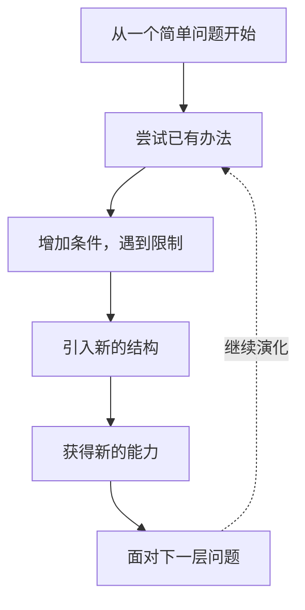
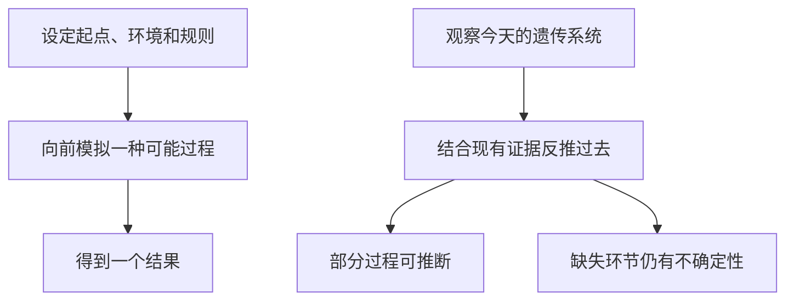
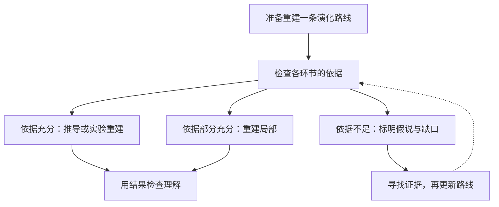

学习一门复杂学科时，我们通常直接面对它的成品。

线性代数里有矩阵、向量空间和特征值；数据库里有索引、事务和日志。每个概念都能找到定义，但定义背下来之后，仍然可能不明白：为什么需要它？如果没有它，会遇到什么困难？

我想尝试另一种学习方式：先回到一个简单的问题，用最朴素的办法解决，再逐步增加困难。旧办法不够用时，寻找新的结构。这样，我们就有机会亲手建立一部分知识，理解系统为什么长成今天的样子。

这就是我理解的 Evo-Learn：**沿着问题推动能力发展的路径学习，尝试重建一个系统。**

**图 1：知识的下一步，有一个具体的理由。** 每次引入新概念，都要说明它解决了什么，以及带来了什么新的问题。

这里的“演化路径”需要先说清楚。我们可以根据真实历史学习，也可以为了理解，构造一条从简单到复杂的概念路线。后者不必严格按照发明的年代排列，但每一步的推理都需要成立。下面的例子属于教学重建，不能直接当成各领域的完整历史。

## 一、哪些系统可以沿着这条路学？

### 线性代数：从解方程，到理解解的结构

假设你只会解一个简单方程，现在遇到了几个未知数、几条相互关联的方程。

你可以先用代入或消元，把未知数逐个消掉。方程越来越多时，反复抄写变量和系数很繁琐。于是，把系数排成一个表，把操作集中在这个表上，矩阵就有了一个具体用途：组织方程，并帮助我们处理它们。

继续求解，又会发现新的情况。有些方程重复表达同一条约束，有些约束互相冲突。放到二维平面上，两条直线可能相交、平行或重合。这时，“有没有解”“解是否唯一”就成为必须回答的问题。独立性、秩和解空间等概念，也有了可以接上的问题。

再增加一个条件：数据来自测量，带着误差，可能根本找不到满足全部方程的精确解。我们便需要明确“误差小”是什么意思，再寻找让总误差尽可能小的解，由此走向最小二乘。

沿着这条路线，学习者能理解这些工具之间的联系。每一步还能通过计算、画图和证明检查。[MIT 的线性代数课程目标](https://web.mit.edu/18.06/www/Fall02/goals.html)也包含消元、解的结构、投影和最小二乘等能力；这里把其中一部分组织成了由问题推动的学习路线。

### 数据库：从存下数据，到让数据可靠地工作

现在换一个问题：做一个保存联系人信息的小程序。

开始时，把数据放在文件里，查找时从头读一遍，已经可以工作。记录增多、查询频繁之后，逐条查找太慢，于是建立方便定位记录的结构，学习索引。索引也需要更新，因此要比较查询收益与维护成本。[PostgreSQL 官方文档](https://www.postgresql.org/docs/18/indexes-intro.html)明确说明了索引在查询效率和数据更新开销之间的取舍。

接着，假设一次业务操作必须同时修改两处数据。程序改完第一处就出错，数据会停在一个不完整的状态。我们由此理解事务：把相关操作组织成一个整体，规定成功与失败时应当怎样处理。

再让程序在运行中崩溃，问题便变成了“恢复后，怎样知道哪些变化应该保留”。这时，可以进一步研究日志和恢复机制。

索引、事务、恢复分别回应不同压力，可以形成不同的学习分支。我们能自己写一个小系统、制造故障、观察结果，再检查设计是否解决了问题。这样，每个部件的作用就更具体了。

### 金融交易系统：从一条规则，到一套可检查的流程

交易系统也可以用类似方式学习。先把一个模糊想法写成明确规则：在什么条件下行动，如何退出，需要哪些数据。

规则写出来之后，就可以拿历史数据重放，观察它会产生怎样的操作。接着考虑手续费、成交价格和无法及时成交等约束，检查最初的模拟遗漏了什么。

随后还要处理投入规模、亏损承受范围、异常数据以及系统中断。于是，仓位管理、风险限制和运行监控逐渐进入系统。

这是一个帮助理解系统构造的例子。我们可以检查规则是否一致、程序是否执行正确、模拟是否遗漏条件。至于规则在未来是否有效，还需要面对变化的市场和未知情况。**重建交易系统的能力，与获得稳定收益，是两个需要分别验证的目标。**

三个例子有一个共同点：问题和条件能够明确表达，系统也能在一定范围内被拆开、构造和检查。我们因此有机会沿着能力发展的路径学习它。

## 二、为什么这样学习可能有效？

从系统论的角度看，一个部件的作用，要放到整体关系里理解。

只背“数据库有日志”，很难知道日志为什么重要。亲手经历一次中断，再尝试恢复数据，日志就和“故障后怎样保持可靠”联系起来了。概念同时带上了问题、条件和用途，之后遇到类似情形，我们也更容易找到它。

从复杂系统演化的角度看，新的能力会改变后续问题。索引让大量查询变得可行，也增加维护工作；系统服务更多人之后，并发与故障问题又变得突出。发展过程中有分支、有取舍，也有反馈。沿着这些关系学习，可以逐步理解整体如何形成。

这也给认知提供了支点。刚解决的问题还很具体，新概念可以接到已经理解的经验上。关于[先前知识与新学习的综述](https://pubmed.ncbi.nlm.nih.gov/32954007/)讨论了已有知识如何影响理解和记忆。但由此解释 Evo-Learn 为什么可能有用，仍然属于机制分析，不能当作整套方法已经得到验证。

引导也要适合学习者。初学者可能需要示范，熟悉基础的人则可以多做独立推导。最后还要撤掉讲解，换个问题试一次：能不能自己选择工具、解释取舍？顺畅地看完路线，只是学习的一部分。

然而，这种方法还有一个更根本的前提：我们得知道，或者能够有依据地重建，系统是怎样一步步形成的。

## 三、生物遗传：我们看到现状，却没有完整的过去

如果把同样的思路用在生物遗传上，困难就明显了。

我们今天可以研究遗传物质怎样复制、变化和传递，也可以比较不同生物的基因。但如果要从一个早期系统出发，完整重演它怎样演化成今天的复杂遗传系统，就需要知道大量过去的信息：中间状态是什么，当时的环境怎样变化，发生过哪些变异，哪些分支延续下来，又有哪些消失了。

这些信息并没有完整地留给我们。

一个现代系统，可能与多种过去的过程相容。即使某条路线能够产生类似结果，也还要检查：真实演化是否走过这条路线？我们有没有足够证据排除其他解释？

**图 2：向前得到一个结果，与反推出真实历史，需要不同的证据。** 模型中能发生的过程，不自动等于自然界实际发生的过程。

因此，生物遗传揭示了这类学习方法的重要局限：**当演化路径缺失、关键条件未知时，我们暂时无法据此完整重演系统。**

这里的“暂时”也很重要。研究者会通过现存序列推断祖先序列，并开展实验，但推断需要模型，也需要评估不确定性。一项利用已知实验演化谱系来[检验祖先序列重建的方法研究](https://www.nature.com/articles/ncomms12847)，就展示了怎样把重建结果与可检查的过程对照。这说明局部重建可以开展；它与恢复整个遗传系统的全部演化历史，仍有很大的距离。

此外，自然演化也不能简单写成“旧办法不够用，于是生物发明了更好的办法”。变异、选择、漂变以及环境变化共同参与其中。“需要某种能力”并不能单独解释它如何出现。若为了让故事顺畅，把缺失部分补成一条必然的进步路线，就会让教学叙事超出证据。

## 四、看不到完整路径之后，还能怎样学？

首先要区分：研究一个系统现在怎样工作，与重演它实际怎样形成，可以达到不同程度。

即使完整历史未知，我们仍可以学习已知的遗传机制，构建简化模型，观察某些条件下会出现什么结果。此时能够得到的是对局部机制或可能过程的理解，结论的范围也应当留在这里。

使用 Evo-Learn 前，可以先画一张“证据地图”：哪些关系能够推导或实验检查，哪些是有证据支持的推断，哪些还缺信息。

**图 3：重建到哪里，取决于依据能支持到哪里。** 一条路线可以同时包含已知部分和待研究部分，要把它们标清楚。

AI 可以帮助整理文献、设计实验、检查推导，也很擅长把知识讲成连贯的故事。但连贯本身不能补上缺失的历史。让 AI 帮忙建立学习路线时，尤其要追问每一步的依据，以及它是在解释已知机制、提出可能过程，还是描述真实历史。

回到线性代数，我们无需知道每个概念的全部发明史，就能从方程推导许多结构。回到数据库，我们无需复刻全部产品史，就能写程序验证一些设计。金融交易系统也可以重建运行流程，但历史测试不能消除未来的不确定性。生物遗传则提醒我们：某些局部机制可以研究，完整路径仍可能超出手里的证据。

我认为，Evo-Learn 的价值，是让我们沿着有依据的生成关系，把复杂知识重新建立起来。它的局限，也就在于这些关系是否可知、可验证，以及我们能重建多大的范围。

**掌握路径时，可以尝试重演；只掌握部分路径时，就先理解和验证那一部分。随着证据、模型和实验工具进步，可以重建的范围也会扩大。**
